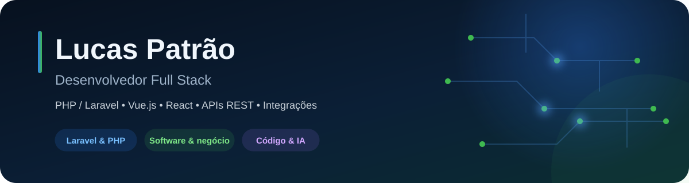

  

  
  

## Sobre mim

Sou **Lucas de Castro Patrão**, **Desenvolvedor Full Stack**, com uma trajetória que começou no suporte técnico e evoluiu para o desenvolvimento de sistemas. Essa experiência me ensinou a ouvir o usuário e entender o problema antes de escrever código.

Minha principal experiência está em **PHP e Laravel**, trabalhando com regras de negócio, **APIs REST**, integrações e manutenção de aplicações em produção. No frontend, atuo com **Vue.js, React e TypeScript**, conectando interfaces às necessidades de cada produto.

Também uso **LLMs e agentes de IA** como apoio para investigar problemas e executar tarefas bem especificadas, mantendo comigo as decisões técnicas e a revisão dos resultados.

> Software bom começa entendendo quem vai usar, o que precisa resolver e por quê.

## Onde gero impacto

<table>
  <tr>
    <td width="33%" valign="top">
      <strong>⚙️ Backend e integrações</strong>  
      Regras de negócio com Laravel, APIs REST, webhooks e comunicação entre sistemas.
    </td>
    <td width="33%" valign="top">
      <strong>💻 Interfaces e produto</strong>  
      Funcionalidades e interfaces com Vue.js, React e TypeScript, com atenção ao usuário.
    </td>
    <td width="33%" valign="top">
      <strong>🔧 Evolução e automação</strong>  
      Manutenção de aplicações, investigação de problemas em produção e automação de processos internos.
    </td>
  </tr>
</table>

## Stack principal

  
  
  
  
  
  
  
  
  
  
  
  
  
  
  
  

## Experiência aplicada em diferentes negócios

Minha trajetória passa por **educação**, **diagnósticos médicos**, **franquias** e **assistência em seguros**, unindo suporte ao usuário, desenvolvimento e evolução de sistemas:

- **Amar Assistência em Seguros · Full Stack Jr · 2026–atual:** manutenção e evolução do sistema da operação com Laravel, Vue.js e MySQL, integrações e investigação de problemas em produção.
- **Ótica Center Franquias · Full Stack Jr 3 · 2025–2026:** evolução do Portal Franqueado, novas funcionalidades e manutenção com Laravel, React, Inertia e TypeScript.
- **One Laudos Diagnósticos Médicos · Full Stack Jr · 2025:** desenvolvimento de aplicações web, integrações por APIs e webhooks e automação de processos internos.
- **Escola Móbile · Suporte → Sistemas · 2020–2024:** suporte técnico e resolução de problemas com código, SQL Server e automações no Fluig.

## Projetos em destaque

- **[Nexa Tickets](https://github.com/lucaspatraodev/nexa-tickets):** organização de chamados de suporte com Laravel, React, Inertia, Docker e MySQL.
- **[StockMaster](https://github.com/lucaspatraodev/stock-master):** cadastro de produtos com validações, logs, documentação e testes, usando Laravel, Vue, Docker e MySQL.
- **[Wine Guide](https://github.com/lucaspatraodev/wine-guide):** landing page para um clube de vinhos, desenvolvida com React e Vite.
- **[QR Code Generator](https://github.com/lucaspatraodev/qrcode-generator):** ferramenta para gerar QR Codes, desenvolvida com React e Vite.

---

  <strong>Entender o problema, ouvir o usuário e construir soluções úteis.</strong>

